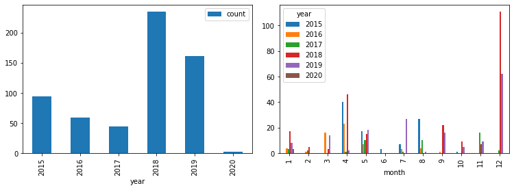

In this post, I will describe the
[~berfr/commit-history-data-analysis](https://git.sr.ht/~berfr/commit-history-data-analysis)
tools and results as well as a few thoughts on version control hosting and
commit histories. There are many tools out there with the purpose of extracting
insights from single code repositories; this one has the goal of analyzing the
many repositories of a single user.

## Commit aggregation

The main script found in the repository mentioned above simply outputs a `git
log` in comma separated values (CSV) format for all the Git repositories found
under a given path and for a specified author. For example, if all your
repositories are under `~/code` and your email is `a@abc.com`, you can execute
the script with `./get-data.sh ~/code a@abc.com`. The resulting CSV log will
then be found at `data/results.csv`. It is also possible to give multiple emails
or names; they will be prepended with `--author` when passed to the `git`
command. The included `git-csvlog` script can be used on its own in Git
projects.

## Data analysis

Once the data is in CSV format in the results file, it is very easy to input
into your favorite data analysis tool for further inspection. In the example
project, a simple Jupyter Notebook file is provided to view a few plots based on
commit dates. The following image shows the number of commits per year as well
as the number of commits per month per year:

The data and insights aren't particularly interesting up to now but that is not
the point. The important part is the simplicity in gathering the data and the
freedom to inspect it however we want. With this, we are not limited to
visualization tools provided by the hosting service.

## Privacy concerns

In this simple research project, I only analyzed a few personal Git repos that
were laying around. The scripts and concepts discussed here can be applied to a
much greater scale to hundreds or thousands of repositories, both personal and
ones contributed to. Also, a few more fields could be extracted from each
commits such as long descriptions and commit diffs. Further techniques such as
natural language and code analysis could be applied on these to extract
additional insights.

Going even deeper, source code hosting data such as pull request information,
repository metadata and interactions could be added to create an even better
picture of a specific user. It is important to remember that the data which is
publicly available on hosting services is most likely quite limited compared to
all the data available internally. Also, imagine what a team of the top data
analysts can find and do with all this valuable data on millions of users.

This data can be used to find personal information and character traits such as
habits, intelligence and vocabulary as well as changes to these over time. The
way you interact with others is also valuable information that could be easy to
find using thousands of comments and replies on various pull requests and
issues. It could also be possible to extract info about code changes like
complexity of changes and whether these changes are getting better or worse over
time. Employers would be very happy to have access to these insights on
potential employees and fortunately for them, the data is very easy to get.

There are a few strategies to avoid revealing too much information such as
scrambling commit dates and times or _trying_ to remain anonymous online. These
techniques aren't foolproof though and they are not long term solutions. In my
opinion, being conscious of these issues and being selective of the work we put
online is a step in the right direction. Open source software is a great thing
and version control is necessary for us to manage it correctly but there will
without a doubt be serious privacy issues regarding it in the near future.
